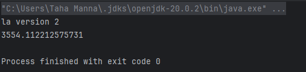
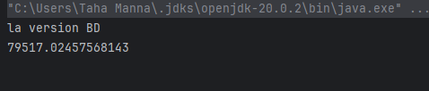
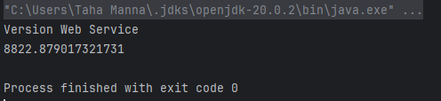
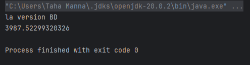
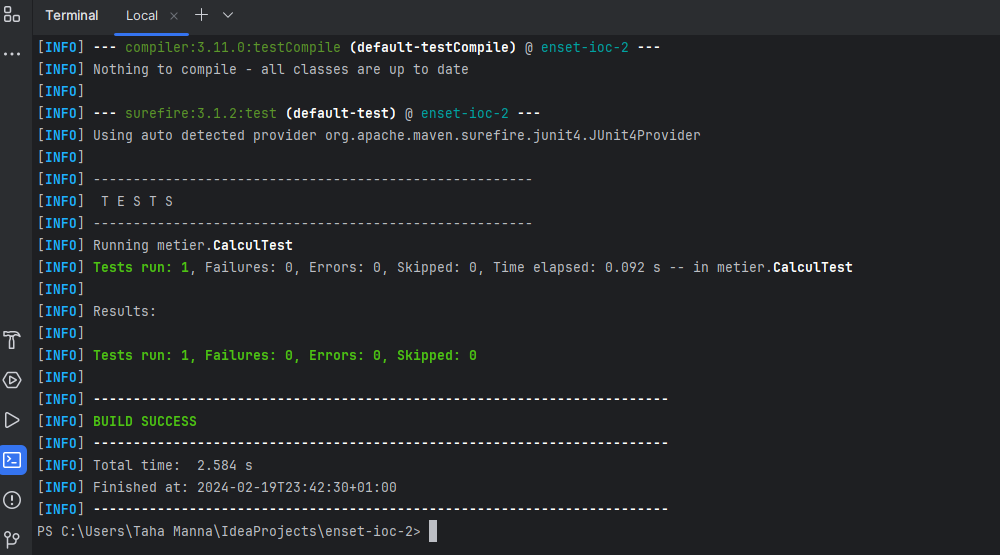

<h3>Compte Rendu : </h3>
<ol>
    <li>Injection des dépendances Version statique :  
    

</li>
    <li>Injection des dépendances Version dynamique : 
    
</li>
    <li>Injection des dépendances En utilisant le Framework Spring XML  :   
    
    
    

    </li>
<li> Injection des dépendances En utilisant le Framework Spring Annotations :   
    

<li> Les Testes unitaires : 
    
</ol>
